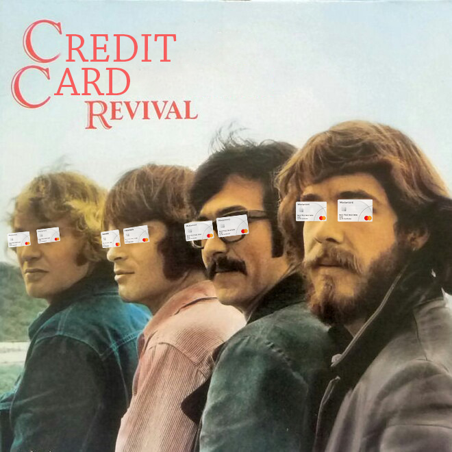

# Mid-Bootcamp Project: Credit Card Revival

#### Objective

The project will focus in a classification problem: as a risk analyst of a bank I will analyse and understand the demographics and other characteristics of the bank customer's that accept or reject a credit card offer. The task is to build a model that will try to predict if the credit card offer is accepted, by using logistic regression and KNN classifier models.

#### Hypothesis 

Can the models used predict if a customer will accept the credit card offer?

#### Data Set

Data from focused marketing study, with 18,000 current bank customers. Dataset included customer's demograpgics like income level, houses owened, household size and some customer's characteristics related to the bank like number of accounts opened, average balance, number of credits cards held, etc.

#### Data Processing and Data Cleaning

Data was quite clean, nevertheless I have decided to clean the headers, replace the null values by the average of the column, and setting the customer number as index as they were unique identifiers.

I used BoxCox transformation and Standscaler as data transformation tecnhiques. As data was imbalanced I have used some tecnhiques to deal with it: SMOTE, class weights, UpSampling and Tomek Links.

#### Models used

For this problem I have decised to use Logistic Regression and KNN Classifier.

#### Results and Conclusions

Overall the models did not perform very well, having troubles to predict the minority class.
The model with better performance was Logistic Regression with Up Sampling technique (accuracy: 0.65, recall: 0.76, F1-score: 0.20)

#### Main libraries used on the project

- Pandas
- Seaborn
- Matplotlib
- Sklearn

